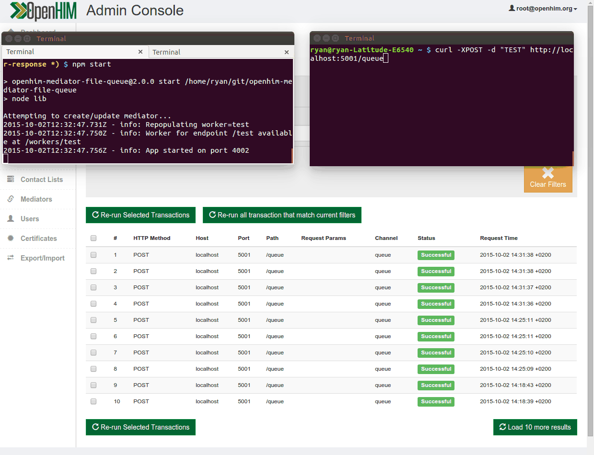
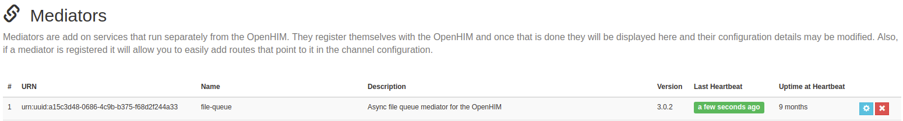
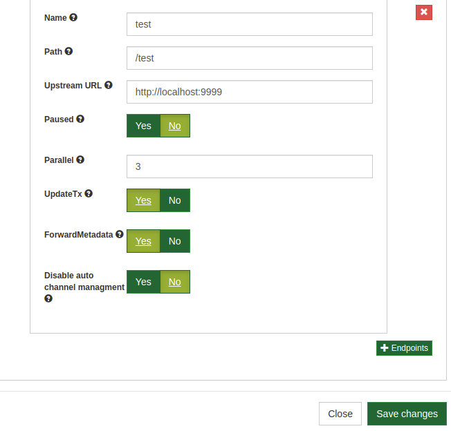

# Openhim Mediator File queue

## Introduction

The function of the file queue is to store requests from a client and send them through to an endpoint at a pace that the endpoint can handle. This rate could be determined by the network speed, the endpoint's computational resources or the endpoints accessibility. The file queue is a service that makes use of the OpenHIM Mediator framework.

If the a clients request fails to make it to the endpoint the file-queue stores the request as a file in an error directory. This is very useful for an unreliable network or endpoint system.

See this visual example of how this works as an OpenHIM mediator. Note the curl commands return instantly but the mediator knows to tell the OpenHIM that these are still processing and updates them after they complete asynchronously.



## How it works

The file queue simply handles incoming requests, writing the files to a directory on the filesystem, and then processes the queue, sending the files to a configured endpoint. If the file is successfully sent, then the queued file is deleted from the filesystem, otherwise it is moved to an error directory.

Multiple `endpoints` can be configured. Each endpoint handles incoming requests for a specific URL, queues them, and then sends them to another configured URL. An endpoint has a `worker` which is responsible for reading the files from the queue and processing them. Workers can process multiple files in parallel as configured (default 2 at a time). Workers can be paused, resumed or repopulated via a REST-like endpoint. Pausing a worker will stop it from processing files from the queue, but the endpoint will continue accepting requests and writing the files to the queue. Repopulating a worker will cause it to refresh its queue from the files on the filesystem. This is useful when manually adding files to or removing files from the queue.

A queue can be paused or resumed in OpenHIM mediator config, or manually as follows:

To pause a queue:
`./scripts/pause.sh <worker-name>`

To resume a queue:
`./scripts/resume.sh <worker-name>`

To repopulate a queue:
`mv ./error/<worker-name>/* ./queue/<worker-name>/`
`./scripts/repopulate.sh <worker-name>`

Each `endpoint` must have a matching channel and route registered in OpenHIM, for receiving requests and forwarding them to the file queue mediator. When the mediator starts up a new channel will automatically be created/updated based off the settings for the upstream server (where the files will be forwarded to). Note the the channel will be updated each time the endpoint settings are updated.

Please note that the following manual steps might be required to get the File Queue to function correctly:

* If the mediator is running on the same server as the OpenHIM server, then you may need to update the route host to the IP address of that server for OpenHIM, instead of using `localhost`.
* The user role `file-queue` has been created by default for all channels. This role needs to be added to the user account which will be used to push new files onto the queue.

Here is an example config for an OpenHIM channel:

```js
  {
    "name": "File Queue",
    "urlPattern": "^/test$",
    "status": "enabled",
    "routes": [
      {
        "name": "File queue",
        "host": "localhost",
        "path": "/test",
        "port": "4002",
        "secured": false,
        "primary": true,
        "type": "http"
      }
    ],
    "authType": "private",
    "allow": [
      "file-queue"
    ]
  }
```

## Endpoint config

An array of endpoints can be configured via the **OpenHIM Console**. An endpoint can have the following properties:

* `name` (required) - The name of the endpoint which is used for setting up the REST-like routes for the worker.
* `path` (required) - The path to use for handling incoming requests. A '\*' may be used to match any number of characters in a path. E.g. 'this/is/a/test/\*'. Note that this path must match the path for the route accepting these requests.
* `url` (required) - The URL to send the files to when processing them from the queue.
* `paused` - Whether or not the endpoint's worker should be paused by default. This must be a boolean value. Defaults to false.
* `parallel` - The number of files that the worker should process in parallel. Defaults to 2.
* `updateTx` - Whether or not to attempt to update the OpenHIM transaction once the message has been processed. Defaults to false.
* `forwardMetadata` - Whether or not to use the url, headers and HTTP method of the original request when it is forwarded. The path of the original request will be appended to the `url` property. Defaults to false.

Here is an endpoint config example :





## Development Startup

### Node & NPM

```sh
npm start
```

Useful environment flags:

* API_PASSWORD=password
* API_USERNAME=root@openhim.org
* API_URL=https://localhost:8080
* HEARTBEAT=true
* LOG_LEVEL=info
* NODE_TLS_REJECT_UNAUTHORIZED=0
* SERVER_PORT=4003
* TRUST_SELF_SIGNED=true

### Docker

> If connecting to a dockerised OpeHIM instance, change the api reference environment variable (`process.env.API_URL`) to the OpenHIM's docker container name.

Build container from project directory:

```sh
docker build -t openhim-mediator-file-queue .
```

Start container:

```sh
docker run --name openhim-mediator-file-queue -p 4002:4002 openhim-mediator-file-queue
```

Useful Flags:

* `--network {openhim-network-name}` connect to a docker bridge network to allow communicating with dockerised OpenHIM
* `--rm` to remove the container when stopped (Useful during development)
* `-e NODE_TLS_REJECT_UNAUTHORIZED=0` add an environment flag to ignore TLS issues if using an OpenHIM instance with self signed certificates.
